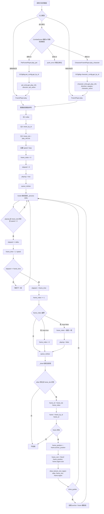

# sa.desktop
sa 桌面版

## 项目定位

`sa.desktop` 是 Windows-only Godot 4.6 桌面宠物客户端. 第一版目标是实现类似 QQ 宠物的桌面挂机体验: 宠物平时以小透明窗口在桌面上播放动作, 可拖拽移动, 可停靠屏幕边缘, 并通过系统托盘管理窗口行为.

## Windows Godot 桌面宠物 MVP

### MVP 范围

- 主运行场景为 `scenes/main.window.tscn`, 当前负责同一个透明窗口内的内容切换. `MainWindow` 启动后只准备透明窗口和系统托盘, 未登录时 `ContentRoot` 保持为空; 账号从 `托盘 -> 选项... -> 账号` 登录, 点击登录时创建一份运行期内存 `AccountRecord`, 登录成功后进入 `game.tscn`.
- 第一版不再维护本地记录文件, `AccountRecord` 只保存在本次运行内存中; 登录默认创建固定角色 `1000011 / 吉米`; 窗口位置、缩放、透明度和穿透状态统一保存到本地运行期 `tray.yaml`.
- 当前游戏入口使用同一个最大 `800x600` 的透明无边框窗口, 页面切换只替换 `MainWindow/ContentRoot` 的子场景, 不创建新窗口.
- `MainWindow` 启动时会同步创建系统托盘入口. 托盘菜单只管理主窗口、设置窗口入口和选项窗口入口, 不依赖宠物控制器.
- 宠物按原始资源大小显示, 默认播放待机动画, 并支持随机挂机动作.
- 支持桌面拖拽, 释放后靠近屏幕边缘时自动吸附.
- 支持系统托盘常驻, 托盘固定提供 `设置...`, `选项...` 和 `退出`; `设置... -> 主控 -> 登陆` 中的缩放和透明滑动条控制主窗口尺寸和内容透明度, `隐藏石器` 控制主窗口显隐, `鼠标穿透` 控制主窗口点击穿透; `自动遇敌` 在已登录游戏页内生成本地开战快照, 敌人属性按 `pet.yaml` growth 和 SavedBase/Raw 公式即时生成; `config/tray.yaml.tpl` 提供默认托盘配置模板, 首次启动生成本地 `tray.yaml`, 运行期文件保存窗口位置, 缩放, 透明度, 鼠标穿透, 字体大小, 颜色主题, 调试边框开关和设置窗口 UI 状态.
- 缩放和透明度都使用设置窗口滑动条控制, 最小 `10%`, 最大 `100%`; 缩放会改变真实主窗口尺寸, `100%` 对应 `800x600`, 调整时以当前窗口中心为锚点.
- 支持开关式鼠标穿透, 开启后通过设置窗口恢复可点击.

第一版不实现背包, 技能, 完整战斗数值, 多宠物同时管理和外部游戏自动化. MVP 的重点是先跑通透明窗口, 托盘, 账号和角色展示闭环.

### 资源管线

现有资源继续作为源数据使用, 不重新生成或复制 PNG.

- `assets/pet/4000101.png`: 宠物图集.
- `assets/pet/4000101.tpsheet`: TexturePacker 图集切帧数据.
- `config/pet.yaml`: 宠物配置, 包含动作、方向和帧 ID.
- `config/pet.skill.yaml`: 宠物技能配置, 由 `ConfigPetSkill` 缓存并通过 `GCfgMgr.petskill` 查询.
- `config/exp.yaml`: 经验等级配置, 每级只配置累计总经验上界 `max`, `GCfgMgr.exp` 会派生等级下界并按总经验推导当前等级、下一等级总经验和是否最高等级.
- `config/tray.yaml.tpl`: 托盘、窗口和设置窗口 UI 状态配置模板, 包含 `window.position`, `window.debug_border`, `menu.font_size`, `menu.colors` 和 `setting`; `setting.window.scale` 控制 `设置... -> 隐藏石器` 下方缩放滑动条的主窗口缩放状态, `setting.window.opacity` 控制其下方 `透明` 滑动条的内容透明度状态, `setting.login.hide_stoneage` 控制 `设置... -> 隐藏石器` 的主窗口显隐状态, `setting.login.click_through` 控制同一行 `鼠标穿透` 状态, `setting.combat.auto_encounter` 由游戏页消费并触发本地自动遇敌; 首次启动时复制生成本地运行期 `tray.yaml`; `tray.yaml` 会被程序整体覆盖写回, 字段注释和默认结构以模板为准; `window/menu` 必须完整配置, 缺失或类型错误会在启动读取时 assert; `setting` 是随界面删改变化的本地 UI 状态, 旧 `window.scale` 会迁移为 `setting.window.scale`, 旧 `window.opacity` 会迁移为 `setting.window.opacity`, 旧 `battle_dialog` 会迁移为 `setting` 并保留可识别字段; 不配置托盘菜单项, 菜单宽度, 宠物 ID, 设置窗口, 选项窗口和退出入口.
- `addons/codeandweb.texturepacker`: 项目保留的 TexturePacker 插件; 第一版不要启用它批量导入全部 `.tpsheet`, 否则会生成大量 `.tres` 并拖慢编辑器.
- `addons/miniyaml`: 项目启用的 YAML 插件, 通过 `YAML` autoload 为运行时配置读取和写回提供解析能力; 运行时启动顺序为 `YAML` Autoload -> `GPB` Autoload -> `GPetCalculator` Autoload -> `GCfgMgr` Autoload -> `GTrayConfig` Autoload -> `GRecord` Autoload -> `GCombatFormation` Autoload -> `GMainWindowGuideDrawer` Autoload -> `GMainWindow` Autoload -> `GTray` Autoload -> 主场景, `GPB` 指向 Godobuf 生成并补上 `class_name PB` 和 `extends Node` 的 `proto/sa.pb.gd`, `GPetCalculator` 作为宠物属性计算全局入口生成 SavedBase/Raw 和战斗面板属性, 初始化阶段只随机化 RNG, 不读取配置; `GCfgMgr` 会在主场景运行前触发 `ConfigManager` 初始化, `GRecord` 在点击登录时创建运行期内存 `AccountRecord`, `GCombatFormation` 提供战斗双方固定站位和绘制层级计算, `GMainWindowGuideDrawer` 提供主窗口调试辅助线和坐标标注绘制入口, `GMainWindow` 保存 `MainWindow._ready()` 注册的真实主窗口实例, `MainWindow` 管理 ContentRoot 下的业务页面切换, 并创建内部 `WindowController` helper 管理真实 OS 窗口, `GTrayConfig` 作为全局托盘配置入口从 `config/tray.yaml.tpl` 初始化本地 `tray.yaml`, `GTray` 作为全局托盘流程入口通过 `GMainWindow.main_window` 读取 `TrayController` 和 `WindowController`; `ConfigManager` 会先通过 `AssetsConfig` 统一扫描 `assets/pet` 和 `assets/character`, 绑定同 ID `.tpsheet` 和内联 offset, 建立运行期 `id -> FrameTable` 帧表索引; 宠物和角色都使用 `.tpsheet` sprite 内联 `offset: [x, y]`; 随后按 `config load -> config check -> assemble` 初始化 `ConfigPetSkill`, `ConfigPet`, `ConfigCharacter`, `ConfigEnemyGroup` 和 `ConfigExp`, 宠物和角色 Entry 挂载 `FrameTable.frame_by_id` 引用, 宠物技能配置挂载为 `GCfgMgr.petskill`, 经验配置挂载为 `GCfgMgr.exp`; 图集路径由资源 ID 和资源目录常量计算, Entry 在 `get_by_id()` 首次访问时按需懒加载 atlas, 不常驻保存路径字符串; 托盘配置使用 MiniYAML 读取并整体覆盖写回本地运行期文件. 配置 YAML 源文件必须使用标准空格缩进和 LF 换行, 读取阶段不修正 tab 缩进.

当前第一版使用 `GCfgMgr`, `GPetCalculator`, `AssetsConfig`, `ConfigPetSkill`, `ConfigPet`, `ConfigCharacter`, `ConfigEnemyGroup` 和 `ConfigExp` 作为运行期配置入口. `GCfgMgr` 是 Godot Autoload 全局入口, 在主场景之前触发共享配置初始化, 后续业务代码通过 `GCfgMgr.petskill`, `GCfgMgr.pet_config`, `GCfgMgr.character_config`, `GCfgMgr.enemy_group_config` 和 `GCfgMgr.exp` 读取已准备好的配置数据, 通过 `GPetCalculator.create_pet()`, `GPetCalculator.calculate_pet_hp()`, `GPetCalculator.calculate_pet_attack()`, `GPetCalculator.calculate_pet_defense()`, `GPetCalculator.calculate_pet_agility()` 和 `GPetCalculator.upgrade_pet()` 处理宠物 SavedBase/Raw 和战斗面板属性. `ConfigExp` 读取 `config/exp.yaml` 的 `levels` 段, 每级只允许配置 `max`, 加载时按协议等级范围派生 `min_exp`, 校验等级完整覆盖 1 到 140、`max` 严格递增且派生经验区间连续不重叠, 并提供 `get_level(total_exp)`, `get_level_min_exp(level)`, `get_next_level_total_exp(total_exp)` 和 `is_max_level(total_exp)` 按累计总经验推导等级状态; 最高等级没有下一等级时返回 `-1`. `ConfigPetSkill.load()` 读取 `config/pet.skill.yaml` 的 `skill` 段并建立技能 ID 索引, 宠物技能 ID 使用 `9000001-9999999` 资产段, 技能详情通过 `skill_slots` 中的非 0 技能 ID 调用 `GCfgMgr.petskill.get_by_id(skill_id)` 查询. `AssetsConfig.load()` 会先以 PNG 文件名中的 ID 为主导扫描 `assets/pet` 和 `assets/character`, 每个 PNG 必须具备同 ID `.tpsheet`; `.tpsheet` sprite 使用数字 `frameid` 表示帧号, 内联 offset 只作为源数据输入, 会和 `.tpsheet` region/margin 换算为 `TexturePackerFrame.anchor_position`; 没有 offset 的帧按零偏移参与锚点换算. 随后 `ConfigPet.load()` 读取 `config/pet.yaml` 并建立宠物配置索引, `ConfigPet.check(GCfgMgr.petskill)` 校验宠物技能槽位引用, `ConfigPet.assemble()` 再把同 ID 帧表引用挂到 `ConfigPet.Entry`; Entry 会同时持有名称、稀有度、元素、`attribute` 原始属性、原始成长配置、技能槽位、描述、结构化 `direction_action_frames`, `frame_by_id` 和按需加载的 `atlas`. 单个宠物 `attribute` 固定接受 `poisonResist`, `paralysisResist`, `sleepResist`, `stoneResist`, `drunkResist`, `confusionResist`, `critical`, `counter`, 这些字段来自 `config/doc/pet_growth_8_0.csv`, 加载后保存在 `ConfigPet.Entry.attribute` 并按整数原值保存; 基础四维由 `growth` 和 `GPetCalculator` 生成 SavedBase/Raw, 战斗面板属性由 Raw 换算. YAML 源结构仍是 `direction -> action -> frame ids`, 加载进内存后会转换为 `ConfigPet.Entry.direction_action_frames[Vector2i(direction, action)] -> ConfigPet.PlayInfo`, `ids` 保存帧号顺序, 方向和动作使用协议生成的 `AssetDirection` 和 `PetAction` 枚举值. `ConfigPet.assemble()` 会在配置初始化阶段断言每个宠物都已合成可播放帧表, 并逐帧校验 YAML 引用的 frame_id 存在; 宠物 `PlayInfo` 不再缓存 `bounds_min`, `bounds_max`, `canvas_anchor_position` 或 `base_size`. 旧宠物托盘 ID/动作菜单已移除, `ConfigPet` 继续服务资源校验、宠物偏移测试场景和战斗四维计算输入; 该流程仍然引用现有 PNG, 不复制图集或每帧数据; `AssetsConfig` 和宠物/角色 Entry 共享同一批帧表引用.

角色偏移测试使用 `ConfigCharacter.Entry` 中的角色播放缓存. `AssetsConfig.load()` 会先以 `assets/character` 下 PNG 为主导扫描同 ID `.tpsheet`, 读取 `.tpsheet` sprite 内联 offset 并换算为 `anchor_position`, 再建立角色 ID 到 `frame_by_id` 的帧表索引; 随后 `ConfigCharacter.load()` 通过 MiniYAML 解析标准空格缩进的 `config/character.yaml`, 只消费其中的 `character:` 段, 以 `character_id -> ConfigCharacter.Entry` 形式缓存基础字段和结构化 `direction_weapon_action_frames` 动作帧表; `ConfigCharacter.assemble()` 再把同 ID `frame_by_id` 引用挂到 Entry 并校验动作帧引用, `get_by_id()` 首次访问时按需懒加载图集. YAML 源结构仍是 `weapon -> direction -> action -> frame ids`, 加载进内存后会转换为 `ConfigCharacter.Entry.direction_weapon_action_frames[Vector3i(direction, weapon, action)] -> ConfigCharacter.PlayInfo`, `ids` 保存帧号顺序, 让播放缓存能用方向, 武器类型和动作直接定位帧号表; 角色 `PlayInfo` 不再缓存 `bounds_min`, `bounds_max`, `canvas_anchor_position` 或 `base_size`. `Entry.atlas` 和 `Entry.frame_by_id` 保存角色级共享资源引用, 角色播放速度固定使用 `Constants.ANIMATION_DEFAULT_SPEED`, 角色循环固定使用 `Constants.ANIMATION_DEFAULT_LOOP`, `CharacterFramePlayer` 只处理角色播放入口, 底层逐帧绘制复用 `FramePlayer`. 测试场景按 `character_id / 10` 聚合为四角色颜色组, 例如 `1000011/1000012/1000013/1000014`, 并使用固定预览锚点比较四个颜色变体. 当前可切换 11 个资源完整的角色组, 武器类型下拉框使用角色测试页本地定义的显示列表.

战斗内容脚本位于 `scripts/scene.combat.gd`, `scenes/combat.tscn` 作为透明战斗展示入口绑定 `CombatScene` 脚本, 战斗辅助脚本保留在 `scripts/combat`. `CombatScene` 只消费自动遇敌生成的 `CombatBattleStart`, 不再内置默认敌人组、模拟己方单位或单独运行自动开战逻辑. `CombatBattleStartFactory` 会通过 `GPetCalculator` 从玩家宠物记录中的 Pet SavedBase/Raw 换算面板属性, 并为自动遇敌敌人按 `ConfigEnemyGroup` 等级规则临时生成 SavedBase/Raw 后换算战斗属性. 宠物和角色播放仍复用 `.png + .tpsheet 内联 offset + yaml` 的锚点换算播放链路, 不复制图集, 不生成 `.sprites` 或 `.tres`.

锚点播放使用同一资源 ID 对应的 PNG、`.tpsheet`、YAML 动作帧表和 `.tpsheet` sprite 内联 offset. offset 只作为加载阶段输入, 没有 offset 的帧使用零偏移; 播放器直接绘制图集 region, 并把 offset 换算成裁剪帧内部的 `anchor_position`, 用于修正帧裁剪尺寸变化导致的动画抖动.

宠物和角色资源都不再使用独立 offsets JSON. 每帧偏移写在同 ID `.tpsheet` 的 sprite `offset: [x, y]` 字段中, 没有该字段的帧按零偏移播放.

`project.godot` 默认禁用编辑器插件自动导入. 如果需要调试 TexturePacker 插件, 只针对少量资源临时启用, 不要让编辑器导入整个 `assets/character` 和 `assets/pet` 目录.

### 窗口与桌面行为

- 技术上仍然是一个 Windows 原生窗口, 当前游戏页面在同一个透明无边框窗口内显示; 未登录时窗口可以保持空透明状态.
- 使用 Godot `DisplayServer` 管理窗口透明、无边框、置顶、大小和位置; 主桌宠窗口默认永远置顶, 会保持在 GoLand 等普通应用窗口上方.
- Windows 原生窗口样式依赖外置 `native/windows_click_through_helper.exe`: 主窗口点击穿透通过它设置扩展窗口样式, 设置窗口最大化按钮通过它移除 Win32 最大化框; helper 缺失或启动失败时直接 assert 暴露问题, 不再回退到 Godot 鼠标穿透 flag.
- 导出运行时需要让 `native/windows_click_through_helper.exe` 跟随 `sa.exe` 一起发布, 保持 `native/` 相对路径不变.
- 启用 per-pixel transparency, 并让 root viewport 使用透明背景.
- 拖拽时移动整个小窗口, 而不是只移动窗口内部节点; 窗口范围内未被业务 UI 消费的空白区域可拖动整个窗口, 调试红框只用于观察窗口范围.
- 设置窗口的透明滑动条作用于 `ContentRoot`, 因此当前挂载的游戏页面会整体透明; MainWindow 透明外壳和调试红框不受该透明度影响.
- 窗口位置限制在当前屏幕可用区域内, 避免宠物移出屏幕.
- 位置, 缩放, 透明度, 穿透状态, 调试边框状态和设置窗口 UI 状态都保存到本地运行期 `tray.yaml`; 主窗口缩放和透明度状态保存到 `setting.window.scale/opacity`, 主窗口显隐状态保存到 `setting.login.hide_stoneage`, 用户期望的鼠标穿透状态保存到 `setting.login.click_through`; 该文件从 `config/tray.yaml.tpl` 首次生成, 后续会被程序整体覆盖写回; 角色记录只保存在本次运行内存中.
- `设置... -> 隐藏石器` 使用显式窗口可见状态; 启动时会按 `setting.login.hide_stoneage` 决定是否默认最小化隐藏窗口; 勾选后通过 `DisplayServer.window_set_mode(WINDOW_MODE_MINIMIZED)` 最小化 Godot 主窗口, 同时临时启用鼠标穿透, 避免透明空窗口挡住桌面点击; 取消勾选时恢复窗口模式和用户原本的穿透设置. Godot 主窗口不调用 `Window.hide()` 切换可见性.
- 系统托盘右键菜单使用强制 native 的 Godot 自绘菜单窗口, 不设置 `StatusIndicator.menu` 或原生托盘 popup 属性, 避免菜单打开期间阻塞主循环, 并让菜单项点击直接触发窗口控制逻辑; 所有托盘菜单项均为固定功能, 窗口状态、字体大小、颜色主题、调试边框开关和设置窗口 UI 状态由 `tray.yaml` 参数化配置; 菜单宽度按实际文本和字体大小自适应; 菜单项支持鼠标悬停高亮, `设置...` 打开复古设置辅助面板, `选项...` 打开 Godot 非阻塞标签窗口, 菜单失去焦点后会自动关闭.
- `设置...` 窗口标题为 `设置`, 使用独立 native Window 显示复古两栏辅助面板, 并禁用标题栏最大化按钮. 缩放滑动条会控制主窗口尺寸并写回 `setting.window.scale`, 其下方 `透明` 滑动条会控制 `ContentRoot` 透明度并写回 `setting.window.opacity`, `隐藏石器` 会控制主窗口显隐并写回 `setting.login.hide_stoneage`, `鼠标穿透` 会控制主窗口点击穿透并写回 `setting.login.click_through`; `自动遇敌` 只写回 `setting.combat.auto_encounter`, 由 `GameScene` 中的运行期控制器消费并触发自动遇敌入口; 其他控件只保存本地 UI 状态到 `setting`, 不启动 `CombatScene`, 不连接外部自动化; 标签页、复选框、下拉框和文本输入变更后即时写回.
- 选项标签窗口包含 `账号`, `系统` 和 `关于`. `账号` 当前只做本地测试登录, 不联网, 点击登录后创建运行期内存记录; `系统` 提供 2px 红色调试边框开关, 用来确认透明窗口实际范围; `关于` 使用极简项目信息.
- Godot-only 优先. 如果纯 Godot 无法稳定隐藏 Windows 任务栏按钮, 先记录为已知限制, 后续再评估 Win32/GDExtension.

## 项目目录

- `addons/`: Godot 插件, 包含 TexturePacker、MiniYAML、Godobuf、YATI 等.
- `assets/`: 图片、图集、动画帧、音效、字体等资源.
- `config/`: 游戏配置, 包含宠物、角色、敌人组、经验和托盘模板等配置.
- `config/pet.skill.yaml`: 宠物技能配置, 由 `ConfigPetSkill` 缓存并通过 `GCfgMgr.petskill` 查询.
- `config/exp.yaml`: 经验等级配置, 由 `ConfigExp` 缓存并通过 `GCfgMgr.exp` 查询.
- `config/tray.yaml.tpl`: 托盘右键菜单样式、窗口状态、调试开关和设置窗口 UI 状态模板, `window` 下保存位置和调试边框, `menu` 下保存 `font_size` 和 `colors`, `setting` 下保存复古设置辅助面板控件状态, 其中 `setting.window.scale` 控制主窗口缩放, `setting.window.opacity` 控制内容透明度, `setting.login.hide_stoneage` 控制主窗口显隐, `setting.login.click_through` 控制鼠标穿透, `setting.combat.auto_encounter` 控制游戏页自动遇敌计时; 所有托盘菜单项都是固定功能, 不在配置中声明; 本地运行期 `tray.yaml` 首次启动自动生成且不入库.
- `config/enemy.group.yaml`: 战斗展示用敌人组配置.
- `proto/`: 数据协议源文件. `proto/sa.proto` 是 Godobuf 总入口, 只负责 import 各业务协议.
- `proto/sa.pb.gd`: Godobuf 生成的 GDScript 协议脚本. `proto/gen.sh` 会在生成后给文件头补上 `class_name PB` 和 `extends Node`, 让它能作为 `GPB` Autoload; 业务代码通过 `GPB.XXX` 使用协议类和枚举.
- `scenes/`: Godot `.tscn` 场景.
- `scenes/main.window.tscn`: 主运行场景, 根节点为 `MainWindow`, 持有 `ContentRoot` 并切换游戏内容; 启动时只创建场景内 `TrayController` 和内部 `WindowController` helper, 并把真实主窗口实例注册到 `GMainWindow.main_window`; 托盘初始化和托盘请求转发由全局 `GTray` 管理, 托盘配置由全局 `GTrayConfig` 管理, 未登录时不加载业务页面.
- `scenes/game.tscn`: 透明游戏页, 读取运行期内存角色记录并播放角色站立动画.
- `scenes/combat.tscn`: 透明战斗入口, 绑定 `scripts/scene.combat.gd` 中的 `CombatScene` 展示脚本, 可展示外部传入的 `CombatBattleStart`.
- `scripts/`: Godot `.gd` 脚本.
- `tests/`: 测试脚本、验证说明或后续自动化测试.

## 协议生成

修改 `proto/*.proto` 后, 在项目根目录运行:

```bash
./proto/gen.sh
```

脚本会直接通过 Godot headless 模式运行 `addons/godobuf/godobuf_cmdln.gd`, 以 `proto/sa.proto` 作为总入口生成 `proto/sa.pb.gd`, 并在生成后给文件头补上 `class_name PB` 和 `extends Node`; Godobuf 会按 import 解析依赖协议. 默认会从 PATH 依次查找 `Godot_v4.6.3-stable_win64_console.exe`, `Godot_v4.6.3-stable_win64.exe`, `Godot.exe` 和 `Godot`, 需要确保 Godot 所在目录已加入 Git Bash 的 PATH, 也可通过 `GODOT_BIN` 覆盖为绝对路径或其他 PATH 中的命令名:

```bash
GODOT_BIN=/path/to/Godot_console.exe ./proto/gen.sh
GODOT_BIN=Godot ./proto/gen.sh
```

运行期业务代码优先通过 `GPB.XXX` 使用协议. 如果协议枚举需要参与脚本 `const` 初始化, 该脚本可以保留本地 `Proto := preload("res://proto/sa.pb.gd")`, 避免 Autoload 在常量初始化阶段不可用.

## 战斗开战前协议

`proto/combat.proto` 当前只定义开战快照, 不定义回合指令和结算. `CombatBattleStart` 只包含 `BattleID` 和场上可见 `UnitList`; 背包宠物和备用宠物不进入开战快照, 避免把对方不应看到的资源发给客户端.

- 战斗单位使用 `CombatUnit.Key.CharacterUUID + CombatUnit.Key.PetUUID` 作为同一场战斗内唯一主键.
- 角色单位: `CharacterUUID=角色记录 UUID`, `PetUUID=0`, `CharacterID=角色资源 ID`, `PetID=0`.
- 玩家出战宠物单位: `CharacterUUID=归属角色记录 UUID`, `PetUUID=宠物记录 UUID`, `CharacterID=归属角色资源 ID`, `PetID=宠物资源 ID`.
- 怪物单位: `CharacterUUID=0`, `PetUUID=本场战斗临时 UUID`, `CharacterID=0`, `PetID=config/enemy.group.yaml 引用的宠物模板 ID`.
- 发起方 1-5 号位是角色位, 6-10 号位是对应角色携带宠物位; 当前单机自动遇敌把默认角色放到 1 号位, 其携带宠物从 6 号位开始顺延.
- 接受方如果 1-5 号位是角色位, 6-10 号位是对应角色携带宠物位; 如果接受方全是宠物, 则从 1,2,3... 顺延放置.
- `CharacterID != 0 && PetID == 0` 表示角色单位, `CharacterID != 0 && PetID != 0` 表示玩家宠物单位, `CharacterID == 0 && PetID != 0` 表示怪物单位, `CharacterID == 0 && PetID == 0` 为非法单位.
- `MountPetID != 0` 表示当前单位挂载骑宠资源, `MountPetID == 0` 表示没有骑宠; 骑宠记录 UUID 不单独传递.
- 单机战斗不通过 `CombatBattleStart` 传递宠物技能列表; 玩家宠物技能从本地宠物记录或宠物配置入口读取, 怪物技能从 `pet.yaml` 模板配置读取.
- `CombatCamp_Initiator=0` 表示战斗发起方, `CombatCamp_Defender=1` 表示被攻击方; 双方阵营都存在 `CharacterID != 0` 的角色或玩家宠物单位时推导为 PVP, 只有一方存在 `CharacterID != 0` 的单位时推导为 PVE.
- `CombatUnitAttribute` 不传等级字段, 调用方统一使用 `Exp` 和配置侧规则推导等级.

## 核心模块

- `WindowController`: `MainWindow` 内部窗口行为 helper, 不作为 Autoload 暴露; 具体执行真实 OS 窗口控制.
- `TrayController`: 控制系统托盘图标和固定功能菜单.
- `SettingDialogController`: 控制托盘 `设置...` 打开的复古设置辅助面板, 使用独立 native Window; 缩放滑动条直接控制主窗口尺寸并写回 `setting.window.scale`, 透明滑动条直接控制 `ContentRoot` 透明度并写回 `setting.window.opacity`, `隐藏石器` 直接控制主窗口显隐并写回 `setting.login.hide_stoneage`, `鼠标穿透` 直接控制主窗口点击穿透并写回 `setting.login.click_through`, `自动遇敌` 写回后由游戏页控制器消费, 其他控件只保存本地 UI 状态, 不启动真实业务场景.
- `OptionsDialogController`: 控制托盘 `选项...` 打开的账号、系统和关于标签窗口.
- `GMainWindow`: Godot Autoload 主窗口实例入口, 全局单例统一使用 `G` 前缀; 只保存 `MainWindow._ready()` 注册的真实主窗口实例, 不执行窗口初始化, 方便托盘和后续窗口相关模块直接通过 `GMainWindow.main_window` 访问主窗口.
- `GTray`: Godot Autoload 全局托盘流程入口, 全局单例统一使用 `G` 前缀; 通过 `GMainWindow.main_window` 读取 `TrayController` 和 `WindowController`, 处理账号登录完成后的页面跳转和调试边框重绘.
- `GTrayConfig`: Godot Autoload 全局托盘配置入口, 全局单例统一使用 `G` 前缀; 负责窗口状态、菜单字体大小、颜色主题、调试边框开关和设置窗口 UI 状态的读取与写回, 本地运行期 `tray.yaml` 缺失或 window/menu 不完整时从模板重建, `setting` 缺失或字段结构落后时会按当前模板补齐并保留可识别值, 旧 `window.scale` 会迁移为 `setting.window.scale`, 旧 `window.opacity` 会迁移为 `setting.window.opacity`, 旧 `battle_dialog` 会迁移为 `setting`, 模板缺失、字段类型错误或写回失败时直接 assert 暴露问题.
- `GCombatFormation`: Godot Autoload 全局战斗站位入口, 全局单例统一使用 `G` 前缀; 提供发起方和接受方各 10 个固定窗口坐标, 并按锚点 y 值计算绘制层级.
- `GMainWindowGuideDrawer`: Godot Autoload 主窗口调试辅助绘制入口, 全局单例统一使用 `G` 前缀; 绘制 17 条窗口对角辅助线、双方固定点位和坐标标签, 不新增绘制节点, 不参与鼠标命中和输入分发.
- `MainWindow`: 主场景控制器, 运行在 `main.window.tscn` 根节点实例上; 持有 `ContentRoot` 和 `WindowController`, 设置透明窗口, 把真实主窗口实例注册到 `GMainWindow.main_window` 后触发 `GTray` 初始化, 绘制可选的 2px 红色调试边框、窗口对角辅助线和双方固定点位下方居中坐标标注, 并替换子场景完成 `game` 切换.
- `GPetCalculator`: Godot Autoload 宠物属性计算入口, 全局单例统一使用 `G` 前缀; 位于 `GPB` 后, `GCfgMgr` 前, 初始化阶段只随机化 RNG, 具体创建和升级方法在调用时读取 `GCfgMgr.pet_config`; 提供 `create_pet(pet_id, level)`, `calculate_pet_hp(...)`, `calculate_pet_attack(...)`, `calculate_pet_defense(...)`, `calculate_pet_agility(...)` 和 `upgrade_pet(...)`, 统一生成 SavedBase/Raw, 换算战斗面板属性并处理宠物升级 Raw 累加.
- `GRecord`: Godot Autoload 运行期账号记录入口, 全局单例统一使用 `G` 前缀; 作为 `Node` Autoload 保存当前内存 `AccountRecord`, 点击登录时创建默认角色记录.
- `GPB`: Godot Autoload 协议入口, 指向 `proto/sa.pb.gd`, 运行期业务脚本优先通过 `GPB.AccountRecord`, `GPB.AssetIDRecord` 等名字访问 Godobuf 生成类型.
- `GameScene`: 游戏内容场景, 使用 `GRecord.record` 中已由登录流程准备好的内存角色记录, 通过 `CharacterFramePlayer` 按角色资源 100% 原始尺寸播放空手向下站立动画并显示角色信息; 同时创建 `AutoEncounterController`, 在 `setting.combat.auto_encounter` 开启后累计 5 秒调用本地开战快照生成入口, 敌方宠物会按敌人组等级规则临时生成 SavedBase/Raw 并换算战斗面板属性.
- `Constants`: 集中定义项目配置文件路径、主窗口业务场景路径、窗口尺寸、调试边框参数、宠物和角色资源目录、动画播放默认参数和运行期 proto 枚举顺序数组. 宠物/角色 ID 范围、稀有度范围、方向、元素、动作和武器类型统一来自协议生成枚举; 因这些枚举参与 `const` 初始化, `Constants` 内部保留本地 `Proto` preload, 运行期调用方优先使用 `GPB`; 配置表字符串 key 不放在公共常量中, 只在对应配置解析或显示边界转换为枚举.
- `Share`: 集中放置跨模块复用的轻量工具函数, 包括配置字段读取、基础类型解析、资源 ID 范围判断和资源图集路径推导.
- `GCfgMgr`: Godot Autoload 全局入口, 全局单例统一使用 `G` 前缀; 位于 `GPetCalculator` Autoload 后启动, 在主场景前触发 `ConfigManager` 初始化, 并暴露 `petskill`, `pet_config`, `character_config`, `enemy_group_config` 和 `exp`.
- `ConfigManager`: 位于 `config/manager.gd`, 同时作为 `GCfgMgr` Autoload 和共享配置管理器, 集中提供 YAML 读取, `assets load -> config load -> config check -> assemble` 流程和共享配置实例.
- `AssetsConfig`: 位于 `assets/assets.gd`, 统一扫描 `assets/pet` 和 `assets/character`, 读取同 ID PNG 和 `.tpsheet`, 合成运行期 `id -> FrameTable` 索引; sprite 帧号只读取数字 `frameid`; 宠物和角色的 `.tpsheet` sprite 内联 offset 必须是 `[x, y]` 两项数组, 加载后会换算成 `TexturePackerFrame.anchor_position`; `FrameTable` 保存资源 ID 和 `frame_id -> TexturePackerFrame` 帧表; 宠物和角色 Entry 挂载 `FrameTable.frame_by_id` 引用, 不复制每帧数据.
- `ConfigPetSkill`: 缓存 `config/pet.skill.yaml` 的宠物技能配置, 提供 `get_ids()`, `has_id(skill_id)` 和 `get_by_id(skill_id) -> ConfigPetSkill.Entry`; 业务代码需要技能详情时通过 `GCfgMgr.petskill.get_by_id(skill_id)` 查询名称和描述.
- `ConfigPet`: 缓存 `config/pet.yaml` 的宠物主体配置, 提供宠物 ID 查询, `has_id(id)` 和 `get_by_id(id) -> ConfigPet.Entry`, 让业务代码可以按 ID 读取名称、稀有度、`Entry.attribute` 原始抗性/暴击/反击属性、原始成长配置、技能槽位、结构化 `direction_action_frames`, `frame_by_id` 和按需加载的 `atlas`; `skill_slots` 只保存技能 ID, `0` 表示空槽位, `load()` 校验单宠物 `skill` 槽位存在、非空、整数形态和宠物技能 ID 段, `check(GCfgMgr.petskill)` 校验非 0 技能槽位引用; `load()` 只读取 YAML, 严格校验单宠物 `attribute` 字段名和整数形态, 并校验 `growth` 基础四维加 SavedBase 最小随机偏移后仍大于 0, 基础四维由 `growth` 和后续公式计算, `assemble()` 消费 `AssetsConfig` 准备好的同 ID 帧表索引并把引用挂到 Entry.
- `ConfigPet.PlayInfo`: 宠物单个方向和动作组合的播放缓存, 只保存 `ids`; key 为 `Vector2i(direction, action)`, 由 `ConfigPet.Entry.get_play_info(direction, action)` 直接定位. 宠物显示位置由场景或控制器固定锚点决定, 不再由 `PlayInfo` 提供画布尺寸.
- `ConfigCharacter.PlayInfo`: 角色单个方向, 武器类型和动作组合的播放缓存, 只保存 `ids`; key 为 `Vector3i(direction, weapon, action)`, 由 `ConfigCharacter.Entry.get_play_info(direction, weapon, action)` 直接定位. 角色显示位置由场景或控制器固定锚点决定, 不再由 `PlayInfo` 提供画布尺寸.
- `ConfigCharacter`: 缓存 `config/character.yaml` 的角色配置, 提供 ID 查询和 `get_by_id(id) -> ConfigCharacter.Entry`; `load()` 解析 YAML, 严格校验 character 段、角色基础字段、`isRole` 类型和每个角色具备全部规定武器类型, 方向和动作, 再把每个 `(direction, weapon, action)` 作为 `direction_weapon_action_frames` 的 key; `assemble()` 消费 `AssetsConfig` 准备好的同 ID 帧表索引, 把 `frame_by_id` 引用挂到 Entry 并校验动作帧引用, `get_by_id()` 首次访问时按需懒加载 atlas.
- `FramePlayer`: 底层图集帧播放器基类, 位于 `scripts/animation/player.gd`; 只保存 atlas, 帧索引, 当前帧序列, speed 和 loop, 并负责 `_process()` 推进帧、`_draw()` 绘制 atlas region 和辅助线; 本节点局部原点就是动画锚点, 不直接读取宠物或角色配置, 也不保存业务画布尺寸.
- `PetFramePlayer`: 宠物专用播放器, 位于 `scripts/animation/pet.player.gd`; `play_pet(pet_id, direction, action, target_anchor_position)` 按宠物 ID 直接显示动作, 并把播放器节点放到调用方指定的目标锚点.
- `CharacterFramePlayer`: 角色专用播放器, 位于 `scripts/animation/character.player.gd`; `play_character(character_id, weapon, direction, action, target_anchor_position)` 按角色 ID, 武器, 方向和动作直接显示角色; 角色播放速度和循环使用默认动画常量.
- `WindowsClickThroughHelper`: 调用 Windows native helper, 对主窗口切换真实点击穿透.
- `ConfigEnemyGroup`: 缓存 `config/enemy.group.yaml` 的敌人组配置, 提供 ID 查询和 `get_enemy_group(id) -> EnemyGroupEntry` 给战斗场景复用; `load()` 严格校验 `enemyGroups` 字段、敌人组 ID、名称、数量范围、等级范围、捕获和宝宝概率、Boss/普通组规则以及 enemy 条目结构, `check()` 只校验 enemy 引用的宠物模板 ID 是否存在.
- `ConfigExp`: 缓存 `config/exp.yaml` 的经验等级配置, YAML 每级只声明累计总经验上界 `max`, 加载时派生运行期 `min_exp`; 提供 `get_level(total_exp)`, `get_level_min_exp(level)`, `get_next_level_total_exp(total_exp)` 和 `is_max_level(total_exp)`; 经验参数都是累计总经验, 最高级没有下一等级时返回 `-1`, 自动遇敌临时敌人用 `get_level_min_exp(level)` 写入能推导出指定等级的最低总经验.
- `CombatScene`: 战斗内容模块脚本, 位于 `scripts/scene.combat.gd`, 只消费外部 `CombatBattleStart` 展示开战单位; 未传入快照时直接 assert, 不在展示层生成默认战斗.
- `CombatFormation`: 位于 `scripts/combat/combat.formation.gd`, 通过 `GCombatFormation` Autoload 暴露; 按固定窗口坐标计算发起方和接受方各 10 个战斗站位, 并按锚点 y 值计算绘制层级.

## 序列帧播放流程

`FramePlayer` 位于 `scripts/animation/player.gd`, 只负责播放已经解析好的帧号序列. 宠物入口由 `PetFramePlayer` 提供, 角色入口由 `CharacterFramePlayer` 提供; 两个具体播放器负责读取对应配置和校验动作参数, 再把 atlas, `frame_by_id` 和 `PlayInfo.ids` 注入底层 `FramePlayer`.



- `frame_index` 是当前播放到序列里的下标, 不是资源帧 ID.
- `frame_ids[frame_index]` 才是真正的 `frame_id`.
- `frame_by_id[frame_id]` 找到的是 `TexturePackerFrame`, 里面包含图集裁剪区域 `region` 和裁剪帧内部锚点 `anchor_position`.
- 宠物和角色侧 `PlayInfo` 都只保存帧号顺序; 外部场景或控制器直接把对应播放器放到目标锚点.
- 真正显示当前帧的是 `draw_texture_rect_region()`, 它从同一张 atlas 中裁出当前帧区域绘制.
- `FramePlayer` 的局部原点就是动画锚点, `-frame.anchor_position` 用来让裁剪帧内部锚点落到本节点原点, 避免不同裁剪尺寸导致动画抖动.

## 测试场景

- `tests/test_pet_offsets.tscn`: 独立同类宠物偏移播放测试页, 不是主流程场景; 调试时可通过运行当前场景、`--scene` 参数或临时设为 `project.godot` 的 `run/main_scene` 启动.
- 运行方式: 在 Godot 中打开该场景后运行当前场景, 或使用 `--scene res://tests/test_pet_offsets.tscn` 启动, 默认选择 `40001` 同类组, 同屏显示 `4000101` 到 `4000106`.
- 该测试场景启动时会临时恢复普通可调整窗口, 关闭桌宠透明、无边框和置顶标志, 避免沿用主项目的小透明桌宠窗口.
- 控制项: 同类组选择、`attack/faint/hurt/defense/stand/walk/attackShort` 动作、8 个方向、播放/暂停、上一帧/下一帧、动作上/下、方向左/右、循环、辅助线和 frame/anchor_position/region 信息; 键盘方向键左右切方向, 上下切动作.
- 验证重点: 同类宠物同屏同步播放时, 每个宠物的锚点辅助线应稳定, 用于对比相似宠物的每帧 `anchor_position` 是否能修正动画抖动.
- `tests/test_character_offsets.tscn`: 独立角色偏移播放测试页, 不作为默认启动场景.
- 运行方式: 在 Godot 中打开该场景后运行当前场景, 或使用 `--scene res://tests/test_character_offsets.tscn` 启动, 默认选择 `100001` 角色组, 同时显示 `1000011/1000012/1000013/1000014` 四个颜色变体.
- 控制项: 角色组选择、武器类型选择、`attack/wave/faint/hurt/defense/sad/angry/sit/stand/throw/nod/walk/happy` 动作、8 个方向、播放/暂停、上一帧/下一帧、循环和辅助线; 方向键左右切换方向, 上下切换动作.
- 验证重点: 2x2 四角色同步播放时, 同组不同颜色的锚点辅助线应稳定且动作节奏一致, 用于观察合并后的角色 `anchor_position` 是否能修正动作抖动.
- 站位规则: 战斗站位当前使用固定窗口坐标; `position_index=0-9` 按顺序映射到配置说明中的 1-10 号点位. 发起方 1-5 是角色位, 6-10 是对应携带宠物位; 接受方如果全是宠物, 则从 1 号位开始顺延.

## 测试清单

- 打开 Godot 4.6 项目, 确认 MiniYAML 编辑器插件已启用, TexturePacker 编辑器插件未启用.
- 确认运行后不会生成 `*.sprites/`、`*.tres` 或 `*.tpsheet.import` 批量导入产物.
- 确认 `project.godot` 中 Autoload 顺序为 `YAML` 在前, `GPB` 随后, `GPetCalculator`, `GCfgMgr`, `GTrayConfig`, `GRecord`, `GCombatFormation`, `GMainWindowGuideDrawer`, `GMainWindow` 和 `GTray` 再随后; 运行主场景和测试场景时, 业务脚本通过 `GPB` 访问协议类型, 通过 `GPetCalculator` 生成宠物 SavedBase/Raw 和战斗面板属性, 通过 `GCfgMgr` 读取已初始化的配置 Entry 和经验配置, 点击登录时通过 `GRecord` 创建运行期内存记录, 游戏流程消费 `GRecord.record`, `CombatScene` 通过 `GCombatFormation` 读取战斗固定站位, `MainWindow._draw()` 通过 `GMainWindowGuideDrawer` 绘制窗口辅助线和坐标标注, `MainWindow._ready()` 把真实主窗口实例注册到 `GMainWindow.main_window`, 窗口行为和窗口内容切换通过 `MainWindow` 控制, 托盘配置通过 `GTrayConfig` 读取 `tray.yaml`, 托盘流程通过 `GTray` 从 `GMainWindow.main_window` 获取主窗口后初始化并响应托盘请求.
- 确认 `GCfgMgr` 启动时触发 `ConfigManager`, `ConfigManager` 按 `assets load -> config load -> config check -> assemble` 初始化配置管理器; `AssetsConfig` 先扫描同 ID PNG 和 `.tpsheet`, 读取 `.tpsheet` sprite 内联 offset, 建立运行期 `id -> FrameTable` 索引; `ConfigPetSkill.load()`, `ConfigPet.load()`, `ConfigCharacter.load()` 和 `ConfigExp.load()` 只读取 YAML, 宠物技能槽位在 `ConfigPet.check(GCfgMgr.petskill)` 阶段校验, 宠物和角色 Entry 在 assemble 阶段挂载 `FrameTable.frame_by_id` 并校验动作帧引用; `AssetsConfig` 和 Entry 共享同一批帧表引用.
- 确认 `ConfigPetSkill` 能按 ID 返回结构化 `ConfigPetSkill.Entry`, 宠物技能 ID 使用 `9000001-9999999` 资产段, `GCfgMgr.petskill.get_by_id(9000002)` 返回“攻击”, `GCfgMgr.petskill.get_by_id(9000003)` 返回“防御”.
- 确认 `ConfigPet` 能按 ID 返回结构化 `ConfigPet.Entry`, 包含名称、稀有度、`Entry.attribute` 原始属性、原始成长配置、技能槽位、结构化 `direction_action_frames`, `frame_by_id` 和按需加载的 `atlas`; 技能详情应通过 `skill_slots` 中的非 0 技能 ID 调用 `GCfgMgr.petskill.get_by_id(skill_id)` 查询; 单宠物 `skill` 必须存在且为非空数组, 槽位必须是整数形态, 值只能是 `0` 或合法宠物技能 ID 段, 在 ID 段内但未定义的技能由 `ConfigPet.check(GCfgMgr.petskill)` 暴露; 单宠物 `attribute` 固定接受 `poisonResist`, `paralysisResist`, `sleepResist`, `stoneResist`, `drunkResist`, `confusionResist`, `critical`, `counter` 且不允许未知字段; `growth.baseVital/baseStr/baseTough/baseDex` 加 SavedBase 最小随机偏移后必须仍大于 0; 基础四维不再从 `attribute` 范围读取, 后续由 `growth` 和公式计算; YAML 字符串方向和动作在加载后应转换为 `Direction` 和 `PetAction` 枚举 key, 且每个宠物必须补齐全部规定方向和宠物动作.
- 确认 `ConfigCharacter.load()` 会暴露 character 段、角色基础字段、`isRole` 类型和动作帧表结构错误; 确认 `ConfigCharacter.Entry.get_play_info(direction, weapon, action)` 能通过 `Vector3i(direction, weapon, action)` 直接定位并返回只含帧号顺序的 `PlayInfo`; 配置完整性和动作帧引用在 `load()` 与 `assemble()` 阶段暴露, 播放器只消费 Entry 图集, 帧表和 `PlayInfo.ids`.
- 确认 `ConfigExp.load()` 会暴露 `levels` 段缺失、等级缺失或超出协议范围、出现废弃 `min` 字段、缺少 `max`、`max` 非整数、`max` 非严格递增以及派生经验区间反向等配置错误; 确认 `GCfgMgr.exp.get_level(0) == 1`, `GCfgMgr.exp.get_level(2) == 2`, `GCfgMgr.exp.get_level_min_exp(2) == 2`, `GCfgMgr.exp.get_next_level_total_exp(0) == 2`, `GCfgMgr.exp.get_level(1224160000) == 140`, 最高级 `get_next_level_total_exp()` 返回 `-1`, 且 `is_max_level()` 返回 `true`.
- 确认 `GPetCalculator.create_pet(pet_id, level)` 返回 `saved_base_vital/saved_base_str/saved_base_tough/saved_base_dex/raw_vital/raw_str/raw_tough/raw_dex`; `calculate_pet_hp(...)`, `calculate_pet_attack(...)`, `calculate_pet_defense(...)` 和 `calculate_pet_agility(...)` 分别返回对应面板整数值; `upgrade_pet(..., 0, ...)` 返回原 Raw, 正数升级次数返回累加后的 Raw.
- 确认宠物和角色播放数据分别通过 `ConfigPet.Entry.get_play_info()` 和 `ConfigCharacter.Entry.get_play_info()` 获取对应 `PlayInfo`; `PetFramePlayer.play_pet()` 和 `CharacterFramePlayer.play_character()` 负责按业务 ID 播放, 底层帧序列交给 `FramePlayer.play()`; `FramePlayer` 只作为公共底层序列帧播放器.
- 确认 `ConfigEnemyGroup.load()` 会暴露敌人组表内字段、范围、Boss/普通组和 enemy 条目配置错误; 确认自动遇敌通过 `CombatBattleStartFactory` 生成 `CombatBattleStart`, `CombatScene` 只消费该开战快照并展示其中的单位.
- 打开 `tests/test_pet_offsets.tscn`, 验证 `4000101` 到 `4000106` 同类宠物同屏显示; 切换 `attack/faint/hurt/defense/stand/walk/attackShort` 和 8 个方向, 使用按钮或键盘左右切方向、上下切动作, 验证全部宠物同步更新且锚点稳定.
- 打开 `tests/test_character_offsets.tscn`, 切换角色组、武器类型、`attack/wave/faint/hurt/defense/sad/angry/sit/stand/throw/nod/walk/happy` 和 8 个方向, 验证四个颜色变体同步播放且锚点稳定; 使用键盘右键按 `upleft -> up -> upright -> right -> downright -> down -> downleft -> left` 循环切方向, 左键反向循环, 上下切动作, 验证按钮状态和动画同步更新.
- 在宠物偏移测试页开启辅助线, 验证当前 frame id、anchor_position 和锚点辅助线显示正常; 在角色偏移测试页开启辅助线, 验证锚点辅助线和当前帧矩形显示正常.
- 需要修正宠物锚点时, 修改对应宠物 `.tpsheet` sprite 的 `offset: [x, y]` 字段; 运行期会换算成 `anchor_position`, 修改后通过宠物偏移测试场景确认锚点稳定.
- 需要修正角色锚点时, 修改对应角色 `.tpsheet` sprite 的 `offset: [x, y]` 字段; 运行期会换算成 `anchor_position`, 修改后通过角色偏移测试场景确认锚点稳定.
- 运行主场景, 确认窗口最大为 `800x600` 透明无边框窗口, 未登录时 `ContentRoot` 为空且根 viewport 保持透明背景.
- 运行主场景, 切换到 GoLand 或其他普通应用窗口后, 确认主桌宠窗口仍保持在上层.
- 运行主场景, 打开 `托盘 -> 选项... -> 账号` 时确认只显示登录按钮和状态提示; 点击登录后确认创建运行期内存记录并进入 `game.tscn`, 且不会创建本地记录文件.
- 重启主场景后再次通过 `托盘 -> 选项... -> 账号` 点击登录, 确认重新创建默认内存记录并直接进入 `game.tscn`, 使用 `CharacterFramePlayer` 展示角色站立动画.
- 打开 `托盘 -> 选项... -> 系统`, 勾选和取消 `显示调试边框`, 验证 2px 红边、两组窗口对角辅助线和双方固定点位序号坐标标注立即显示或隐藏, 且 `tray.yaml` 中 `window.debug_border` 被同步修改.
- 登录进入 `game.tscn` 后按住窗口范围内空白区域拖动, 验证整个透明窗口移动; 点击 game 按钮、输入框或其他控件时不触发窗口拖拽; 关闭 `显示调试边框` 后仍可拖拽.
- 登录进入 `game.tscn` 后通过 `设置... -> 主控 -> 登陆` 中 `隐藏石器` 下方的缩放滑动条切换缩放, 验证 `100%` 时真实窗口为 `800x600`, `50%` 时约为 `400x300`, 且窗口以中心为锚点缩放, 角色、文本和页面控件一起缩放.
- 登录进入 `game.tscn` 后通过 `设置... -> 主控 -> 登陆` 中 `缩放` 下方的 `透明` 滑动条切换透明度, 验证游戏文本、角色动画和 `ContentRoot` 当前页面整体同步变透明, 且调试红框、窗口对角辅助线和双方固定点位标注不随内容透明度变淡.
- 登录进入游戏页后开启自动遇敌, 验证进入战斗页时 `CombatScene` 显示 `CombatBattleStart` 中的单位, 且不生成默认模拟战斗.
- 运行主场景, 验证启动后系统托盘图标出现, 右键菜单可打开且只显示 `设置...`, `选项...` 和退出; 点击 `设置...` 后确认设置窗口标题为 `设置`, 显示近似参考图的复古两栏面板, 缩放滑动条位于 `隐藏石器` 下方, `透明` 滑动条位于 `缩放` 下方, 且 `鼠标穿透` 位于 `隐藏石器` 右侧.
- 运行主场景, 勾选 `设置... -> 隐藏石器` 后确认主窗口最小化隐藏并临时启用鼠标穿透, 且 `tray.yaml` 中 `setting.login.hide_stoneage` 写回为 `true`; 取消勾选后确认主窗口恢复显示, 缩放、透明度和 `setting.login.click_through` 对应的鼠标穿透状态恢复为当前配置值, 且 `hide_stoneage` 写回为 `false`.
- 运行主场景, 修改 `设置...` 窗口中的标签页、其他复选框、下拉框和文本输入, 验证 `tray.yaml` 的 `setting` 会即时写回; 关闭窗口并重新打开后确认控件状态恢复.
- 使用旧版无 `setting` 但含 `battle_dialog` 的本地 `tray.yaml` 启动, 验证原有 `window/menu` 设置保留, 且程序会迁移为当前 `setting` 默认字段并保留可识别值.
- 运行主场景, 修改 `tray.yaml` 的 `window.position`, `setting.window.scale`, `setting.window.opacity`, `window.debug_border`, `menu.font_size/colors` 或 `setting.login.click_through` 后重启, 验证窗口状态、`setting.login.hide_stoneage` 显隐状态、鼠标穿透状态、菜单样式、调试红边开关和设置窗口控件状态按配置生效; 所有托盘菜单项不受配置隐藏影响.

## 待改进项

- `1000021/1000022/1000023/1000024` 角色组的 `unarmed attack` 需要后续单独适配. 当前四个颜色变体的空手攻击帧数量和帧序列不同, 在四角色同步测试页中不能直接按同一动作节奏判断偏移稳定性. 后续可在测试页支持按角色组屏蔽特定动作, 或为该组增加动作别名/专用播放规则.
- 后续新增角色资源时, 需要同步补齐 `config/character.yaml` 的角色配置表和动作帧映射; 需要修正锚点时在 `.tpsheet` sprite 中补充内联 offset, 并通过角色偏移测试场景校验后再纳入可选角色组.
