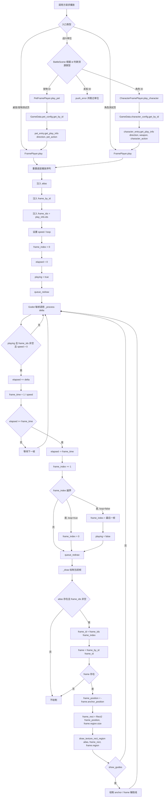

# sa.desktop
sa 桌面版

## 项目定位

`sa.desktop` 是 Windows-only Godot 4.6 桌面宠物客户端. 第一版目标是实现类似 QQ 宠物的桌面挂机体验: 宠物平时以小透明窗口在桌面上播放动作, 可拖拽移动, 可停靠屏幕边缘, 并通过系统托盘管理窗口行为.

## Windows Godot 桌面宠物 MVP

### MVP 范围

- 主运行场景为 `scenes/world.tscn`, 当前负责同一个透明窗口内的内容切换. `World` 启动后加载 `login.tscn`, 登录确认后根据 `record/character.yaml` 中是否已有角色切到 `game.tscn` 或 `character.create.tscn`.
- `record/character.yaml` 是开发期本地角色存档, 使用 YAML 保存账号, 明文密码和角色记录; 账号密码会在启动登录页时自动填入.
- 当前登录, 创建角色, 游戏和战斗入口共用一个 `800x600` 透明无边框窗口, 页面切换只替换 `World/ContentRoot` 的子场景, 不创建新窗口.
- 旧桌宠小窗口, 托盘和挂机战斗脚本仍保留, 但当前主流程优先跑通登录 -> 创建角色 -> 游戏场景闭环.
- 宠物按原始资源大小显示, 默认播放待机动画, 并支持随机挂机动作.
- 支持桌面拖拽, 释放后靠近屏幕边缘时自动吸附.
- 支持系统托盘常驻, 托盘菜单由 `config/tray_menu.yaml` 配置显示项, 顺序, 文案, 层级关系, 字体大小, 颜色主题, 缩放, 透明度选项以及桌宠动作和方向白名单; 宠物 ID 选项经 `ConfigPet` 来自当前 `config/pet.yaml` 资源配置, 动作和方向由托盘配置白名单和当前宠物实际资源共同决定; `选项...` 会打开账号和关于标签窗口.
- 支持通过托盘 `开始挂机战斗/返回桌宠` 在同一个透明无边框置顶窗口内切换桌宠内容和战斗内容.
- 默认支持缩放预设: `10%`, `20%`, `30%`, `40%`, `50%`, `60%`, `70%`, `80%`, `90%`, `100%`.
- 默认支持透明度预设: `10%`, `20%`, `30%`, `40%`, `50%`, `60%`, `70%`, `80%`, `90%`, `100%`.
- 支持开关式鼠标穿透, 开启后通过托盘菜单恢复可点击.

第一版不实现背包, 技能, 战斗数值, 多宠物同时管理和外部游戏自动化. MVP 的重点是先跑通桌宠核心体验.

### 资源管线

现有资源继续作为源数据使用, 不重新生成或复制 PNG.

- `assets/pet/4000101.png`: 宠物图集.
- `assets/pet/4000101.tpsheet`: TexturePacker 图集切帧数据.
- `config/pet.yaml`: 宠物配置, 包含动作、方向和帧 ID.
- `config/tray_menu.yaml`: 托盘右键菜单配置, 包含菜单项, 层级关系, 文案, `font_size`, `colors`, 缩放和透明度选项, 以及桌宠动作和方向白名单; 不配置菜单宽度和宠物 ID.
- `addons/codeandweb.texturepacker`: 项目保留的 TexturePacker 插件; 第一版不要启用它批量导入全部 `.tpsheet`, 否则会生成大量 `.tres` 并拖慢编辑器.
- `addons/miniyaml`: 项目启用的 YAML 插件, 通过 `YAML` autoload 为运行时配置读取提供解析能力; 运行时启动顺序为 `YAML` Autoload -> `GameData` Autoload -> `RoleRecord` Autoload -> 主场景, `GameData` 会在主场景运行前触发 `ConfigManager` 初始化, `RoleRecord` 会读取 `record/character.yaml`; `ConfigManager` 会先通过 `ConfigAssets` 统一扫描 `assets/pet` 和 `assets/character`, 绑定同 ID `.tpsheet` 和内联 offset, 建立运行期 `id -> FrameTable` 帧表索引; 宠物和角色都使用 `.tpsheet` sprite 内联 `offset: [x, y]`; 随后按 `config load -> config check -> assemble` 初始化 `ConfigPet`, `ConfigCharacter` 和 `ConfigEnemyGroup`, 宠物和角色 Entry 挂载 `FrameTable.frame_by_id` 引用, 不复制每帧 `TexturePackerFrame`; 图集路径由资源 ID 和资源目录常量计算, Entry 在 `get_by_id()` 首次访问时按需懒加载 atlas, 不常驻保存路径字符串; 托盘菜单配置仍保留项目内轻量读取逻辑. 配置 YAML 源文件必须使用标准空格缩进和 LF 换行, 读取阶段不修正 tab 缩进.

当前第一版使用 `GameData`, `ConfigAssets`, `ConfigPet` 和 `ConfigCharacter` 作为运行期数据入口. `GameData` 是 Godot Autoload 全局入口, 在主场景之前触发共享配置初始化, 后续业务代码通过 `GameData.pet_config`, `GameData.character_config` 和 `GameData.enemy_group_config` 读取已准备好的数据. `ConfigAssets.load()` 会先以 PNG 文件名中的 ID 为主导扫描 `assets/pet` 和 `assets/character`, 每个 PNG 必须具备同 ID `.tpsheet`; `.tpsheet` sprite 使用数字 `frameid` 表示帧号, 内联 offset 只作为源数据输入, 会和 `.tpsheet` region/margin 换算为 `TexturePackerFrame.anchor_position`; 没有 offset 的帧按零偏移参与锚点换算. 随后 `ConfigPet.load()` 读取 `config/pet.yaml` 并建立宠物配置索引, `ConfigPet.assemble()` 再把同 ID 帧表引用挂到 `ConfigPet.Entry`; Entry 会同时持有名称、稀有度、元素、属性范围、成长范围、技能槽位、描述、结构化 `direction_action_frames`, `frame_by_id` 和按需加载的 `atlas`, 技能详情通过 `skill_slots` 中的非 0 技能 ID 调用 `ConfigPet.get_skill(skill_id)` 查询. 顶层 `attribute` 默认倍率字段固定为 `critRate`, `counterRate`, `dodgeRate`, `hitRate`, `critDamageBonusRate`, `statusResistRate`, `ConfigPet.load()` 会校验字段完整性、重复、未知字段、数值类型和 `[0, 1]` 范围; 单个宠物 `attribute` 只接受 `hp`, `attack`, `defense`, `agility` 和固定倍率字段, 倍率字段缺失时继承顶层默认值. YAML 源结构仍是 `direction -> action -> frame ids`, 加载进内存后会转换为 `ConfigPet.Entry.direction_action_frames[Vector2i(direction, action)] -> ConfigPet.PlayInfo`, `ids` 保存帧号顺序, 方向和动作使用 `Constants.Direction` 和 `Constants.PetAction` 枚举值. `ConfigPet.assemble()` 会在配置初始化阶段断言每个宠物都已合成可播放帧表, 并逐帧校验 YAML 引用的 frame_id 存在; 宠物 `PlayInfo` 不再缓存 `bounds_min`, `bounds_max`, `canvas_anchor_position` 或 `base_size`. 桌宠主流程由 `TrayOptionBuilder` 从 `ConfigPet.get_ids()` 派生可切换宠物选项, 没有有效持久化选择时随机选择初始宠物, 并按 `config/tray_menu.yaml` 的 `pet_actions` 和 `pet_directions` 白名单从 `ConfigPet.Entry.direction_action_frames` 派生 `TrayActionOption` 动作菜单和方向; `PetController` 使用固定桌宠画布和固定锚点兼容旧窗口控制器, 不再合并多个动作的动画边界. 该流程仍然引用现有 PNG, 不复制图集或每帧数据; `ConfigAssets` 和宠物/角色 Entry 共享同一批帧表引用.

角色偏移测试使用 `ConfigCharacter.Entry` 中的角色播放缓存. `ConfigAssets.load()` 会先以 `assets/character` 下 PNG 为主导扫描同 ID `.tpsheet`, 读取 `.tpsheet` sprite 内联 offset 并换算为 `anchor_position`, 再建立角色 ID 到 `frame_by_id` 的帧表索引; 随后 `ConfigCharacter.load()` 通过 MiniYAML 解析标准空格缩进的 `config/character.yaml`, 只消费其中的 `character:` 段, 以 `character_id -> ConfigCharacter.Entry` 形式缓存基础字段和结构化 `direction_weapon_action_frames` 动作帧表; `ConfigCharacter.assemble()` 再把同 ID `frame_by_id` 引用挂到 Entry 并校验动作帧引用, `get_by_id()` 首次访问时按需懒加载图集. YAML 源结构仍是 `weapon -> direction -> action -> frame ids`, 加载进内存后会转换为 `ConfigCharacter.Entry.direction_weapon_action_frames[Vector3i(direction, weapon, action)] -> ConfigCharacter.PlayInfo`, `ids` 保存帧号顺序, 让播放缓存能用方向, 武器类型和动作直接定位帧号表; 角色 `PlayInfo` 不再缓存 `bounds_min`, `bounds_max`, `canvas_anchor_position` 或 `base_size`. `Entry.atlas` 和 `Entry.frame_by_id` 保存角色级共享资源引用, 角色播放速度固定使用 `Constants.ANIMATION_DEFAULT_SPEED`, 角色循环固定使用 `Constants.ANIMATION_DEFAULT_LOOP`, `CharacterFramePlayer` 只处理角色播放入口, 底层逐帧绘制复用 `FramePlayer`. 测试场景按 `character_id / 10` 聚合为四角色颜色组, 例如 `1000011/1000012/1000013/1000014`, 并使用固定预览锚点比较四个颜色变体. 当前可切换 11 个资源完整的角色组, 武器类型下拉框使用角色测试页本地定义的显示列表.

战斗展示脚本仍保留在 `scripts/desktop/battle`, 当前新增 `scenes/battle.tscn` 作为透明战斗入口并复用 `BattleScene` 脚本. 后续如果要从游戏场景进入战斗, 应继续通过 `scenes/world.tscn` 的公共透明画布切换内容; 宠物和角色播放仍复用 `.png + .tpsheet 内联 offset + yaml` 的锚点换算播放链路, 不复制图集, 不生成 `.sprites` 或 `.tres`.

锚点播放使用同一资源 ID 对应的 PNG、`.tpsheet`、YAML 动作帧表和 `.tpsheet` sprite 内联 offset. offset 只作为加载阶段输入, 没有 offset 的帧使用零偏移; 播放器直接绘制图集 region, 并把 offset 换算成裁剪帧内部的 `anchor_position`, 用于修正帧裁剪尺寸变化导致的动画抖动.

宠物和角色资源都不再使用独立 offsets JSON. 每帧偏移写在同 ID `.tpsheet` 的 sprite `offset: [x, y]` 字段中, 没有该字段的帧按零偏移播放.

`project.godot` 默认禁用编辑器插件自动导入. 如果需要调试 TexturePacker 插件, 只针对少量资源临时启用, 不要让编辑器导入整个 `assets/character` 和 `assets/pet` 目录.

### 窗口与桌面行为

- 技术上仍然是一个 Windows 原生窗口, 但当前登录, 创建角色, 游戏和战斗页面都在同一个透明无边框窗口内显示.
- 使用 Godot `DisplayServer` 管理窗口透明、无边框、置顶、大小和位置.
- 真实点击穿透依赖 `native/windows_click_through_helper.exe` 设置 Win32 扩展窗口样式; Godot 鼠标穿透 flag 只作为 helper 缺失时的 fallback.
- 导出运行时需要让 `native/windows_click_through_helper.exe` 跟随 `sa.exe` 一起发布, 保持 `native/` 相对路径不变.
- 启用 per-pixel transparency, 并让 root viewport 使用透明背景.
- 拖拽时移动整个小窗口, 而不是只移动窗口内部节点.
- 窗口位置限制在当前屏幕可用区域内, 避免宠物移出屏幕.
- 位置, 缩放, 透明度, 穿透状态, 当前宠物 ID 和旧账号占位登录状态保存到 `user://settings.json`; 新登录流程的账号, 明文密码和角色记录保存到 `record/character.yaml`.
- 托盘菜单的显示/隐藏使用显式窗口可见状态; 隐藏时会隐藏宠物节点, 最小化并隐藏主窗口, 同时临时启用鼠标穿透, 避免透明空窗口挡住桌面点击; 显示时恢复窗口和用户原本的穿透设置.
- 系统托盘右键菜单使用强制 native 的 Godot 自绘菜单窗口, 不设置 `StatusIndicator.menu` 或原生托盘 popup 属性, 避免菜单打开期间阻塞主循环, 并让菜单项点击直接触发窗口控制逻辑; 菜单显示项, 顺序, 文案, 层级关系, 字体大小, 颜色主题, 缩放, 透明度选项以及桌宠动作和方向白名单由 `config/tray_menu.yaml` 参数化配置, 宠物 ID 经 `ConfigPet` 从 `config/pet.yaml` 派生, 动作和方向由托盘配置白名单与当前宠物资源共同决定; 菜单宽度按当前层级实际文本和字体大小完全自适应, 高度按屏幕可用区域动态限高并在选项过多时滚动; 菜单项支持鼠标悬停高亮, 缩放, 透明度和宠物通过 "宠物 -> ID" 选择, 动作通过 "宠物 -> 动作 -> 动作名 -> 方向" 多级菜单立即播放, `选项...` 打开 Godot 非阻塞标签窗口, 鼠标进入子菜单时对应入口保持高亮, 菜单层级之间保留过渡热区避免移入子菜单时误关闭, 菜单组失去焦点后会自动关闭.
- 选项标签窗口包含 `账号` 和 `关于`. `账号` 当前只做邮箱注册/登录的本地占位逻辑, 不联网, 不保存密码, 不调用后端接口; `关于` 使用极简项目信息.
- 挂机战斗模式不改变窗口实例, 仍保持透明、无边框、置顶. 进入战斗时扩大窗口并隐藏 `PetModule`, 暂停单宠物随机移动, 显示透明背景的 `BattleModule`; 返回桌宠时清空战斗单位, 恢复桌宠窗口尺寸和位置.
- Godot-only 优先. 如果纯 Godot 无法稳定隐藏 Windows 任务栏按钮, 先记录为已知限制, 后续再评估 Win32/GDExtension.

## 项目目录

- `addons/`: Godot 插件, 包含 TexturePacker、MiniYAML、protobuf、YATI 等.
- `assets/`: 图片、图集、动画帧、音效、字体等资源.
- `config/`: 游戏配置, 包含宠物和角色配置.
- `config/tray_menu.yaml`: 托盘右键菜单结构和样式配置, `font_size`, `colors`, `pet_actions` 和 `pet_directions` 在 `menu` 下配置, 缩放和透明度选项在对应菜单项下内联配置.
- `config/enemy.group.yaml`: 战斗展示用敌人组配置.
- `record/character.yaml`: 本地角色存档, 保存账号, 明文密码, 角色 ID, 角色名, 元素和初始属性.
- `protocols/`: 协议定义或本地数据协议.
- `scenes/`: Godot `.tscn` 场景.
- `scenes/world.tscn`: 主运行场景, 持有 `ContentRoot` 并切换登录, 创建角色, 游戏和战斗内容.
- `scenes/login.tscn`: 透明登录页, 从 `RoleRecord` 读取账号密码并决定后续场景.
- `scenes/character.create.tscn`: 透明创建角色页, 选择角色资源, 输入名字并选择地水风火属性.
- `scenes/game.tscn`: 透明游戏页, 读取角色存档并播放角色站立动画.
- `scenes/battle.tscn`: 透明战斗入口, 复用现有 `BattleScene` 展示脚本.
- `scripts/`: Godot `.gd` 脚本.
- `tests/`: 测试脚本、验证说明或后续自动化测试.

## 核心模块

- `PetController`: 控制宠物动作播放, 随机挂机动作, 方向切换, 运行时宠物资源切换, 固定桌宠窗口布局, 并缓存当前宠物可用动作菜单数据.
- `WindowController`: 控制透明窗口、拖拽、边缘吸附、缩放、透明度、鼠标穿透和位置保存.
- `TrayController`: 控制系统托盘图标和配置化菜单.
- `OptionsDialogController`: 控制托盘 `选项...` 打开的账号/关于标签窗口.
- `TrayMenuConfig`: 读取和整理 `config/tray_menu.yaml` 的菜单结构, 字体大小, 颜色主题, 数值选项以及宠物动作/方向白名单; 动作和方向字符串只在这里解析成枚举, 配置缺失或错误时回退内置默认值.
- `SettingsStore`: 读写 `user://settings.json`, 将设置 JSON 转换为 `SettingsData`, 保存窗口状态、宠物 ID 和账号占位登录状态.
- `World`: 主场景控制器, 设置透明窗口, 持有 `ContentRoot`, 并通过替换子场景完成 `login`, `character.create`, `game`, `battle` 切换.
- `RoleRecord`: Godot Autoload 本地角色存档入口, 读取和写入 `record/character.yaml`, 暴露账号, 密码和角色记录.
- `LoginScene`: 登录内容场景, 默认填入 `RoleRecord` 中的账号密码; 点击确定后保存账号密码, 有角色则进入游戏, 无角色则进入创建角色; 点击取消退出.
- `CharacterCreateScene`: 创建角色内容场景, 从 `GameData.character_config` 列出 `isRole=true` 的角色, 创建后写入固定初始属性并进入游戏.
- `GameScene`: 游戏内容场景, 从 `RoleRecord` 读取角色记录, 使用 `CharacterFramePlayer` 播放空手向下站立动画并显示角色信息.
- `Constants`: 集中定义项目配置文件路径、宠物和角色 ID 范围、稀有度范围、宠物和角色资源目录、动画播放默认参数、运行期枚举及枚举顺序数组. 配置表字符串 key 不放在公共常量中, 只在对应配置解析或显示边界转换为枚举.
- `GameData`: Godot Autoload 全局入口, 位于 `YAML` Autoload 后启动, 在主场景前触发 `ConfigManager` 初始化, 并暴露 `pet_config`, `character_config` 和 `enemy_group_config`.
- `ConfigManager`: 统一加载 `scripts/config` 下的配置管理器, 集中提供 YAML 读取, `assets load -> config load -> config check -> assemble` 流程和共享配置实例.
- `ConfigAssets`: 位于 `scripts/config/assets.gd`, 统一扫描 `assets/pet` 和 `assets/character`, 读取同 ID PNG 和 `.tpsheet`, 合成运行期 `id -> FrameTable` 索引; sprite 帧号只读取数字 `frameid`; 宠物和角色的 `.tpsheet` sprite 内联 offset 必须是 `[x, y]` 两项数组, 加载后会换算成 `TexturePackerFrame.anchor_position`; `FrameTable` 保存资源 ID 和 `frame_id -> TexturePackerFrame` 帧表; 宠物和角色 Entry 挂载 `FrameTable.frame_by_id` 引用, 不复制每帧数据.
- `ConfigPet`: 缓存 `config/pet.yaml` 的宠物配置, 提供技能 ID 查询、默认属性查询、宠物 ID 查询, `has_id(id)` 和 `get_by_id(id) -> ConfigPet.Entry`, 让业务代码可以按 ID 读取名称、稀有度、属性范围、成长范围、技能槽位、结构化 `direction_action_frames`, `frame_by_id` 和按需加载的 `atlas`; `skill_slots` 保存技能 ID, 需要技能详情时通过 `get_skill(skill_id)` 查询; `load()` 只读取 YAML, 严格校验顶层默认倍率属性和单宠物 `attribute` 字段名, `assemble()` 消费 `ConfigAssets` 准备好的同 ID 帧表索引并把引用挂到 Entry.
- `ConfigPet.PlayInfo`: 宠物单个方向和动作组合的播放缓存, 只保存 `ids`; key 为 `Vector2i(direction, action)`, 由 `ConfigPet.Entry.get_play_info(direction, action)` 直接定位. 宠物显示位置由场景或控制器固定锚点决定, 不再由 `PlayInfo` 提供画布尺寸.
- `ConfigCharacter.PlayInfo`: 角色单个方向, 武器类型和动作组合的播放缓存, 只保存 `ids`; key 为 `Vector3i(direction, weapon, action)`, 由 `ConfigCharacter.Entry.get_play_info(direction, weapon, action)` 直接定位. 角色显示位置由场景或控制器固定锚点决定, 不再由 `PlayInfo` 提供画布尺寸.
- `TrayActionOption`: 托盘动作菜单使用的结构化动作选项, 保存动作 id, 显示 label 和可用 directions.
- `TrayPetOption`: 宠物切换菜单使用的结构化宠物选项, 保存宠物 id 和显示 label.
- `TrayOptionBuilder`: 位于 `scripts/tray/option.builder.gd`, 基于已经通过 `ConfigPet.check()` 的 `ConfigPet.Entry` 派生 `TrayPetOption`, 并从 `direction_action_frames` 派生托盘动作菜单的 `TrayActionOption`.
- `ConfigCharacter`: 缓存 `config/character.yaml` 的角色配置, 提供 ID 查询和 `get_by_id(id) -> ConfigCharacter.Entry`; `load()` 解析 YAML, 严格校验 character 段、角色基础字段、`isRole` 类型和每个角色具备全部规定武器类型, 方向和动作, 再把每个 `(direction, weapon, action)` 作为 `direction_weapon_action_frames` 的 key; `assemble()` 消费 `ConfigAssets` 准备好的同 ID 帧表索引, 把 `frame_by_id` 引用挂到 Entry 并校验动作帧引用, `get_by_id()` 首次访问时按需懒加载 atlas.
- `FramePlayer`: 底层图集帧播放器基类, 位于 `scripts/animation/player.gd`; 只保存 atlas, 帧索引, 当前帧序列, speed 和 loop, 并负责 `_process()` 推进帧、`_draw()` 绘制 atlas region 和辅助线; 本节点局部原点就是动画锚点, 不直接读取宠物或角色配置, 也不保存业务画布尺寸.
- `PetFramePlayer`: 宠物专用播放器, 位于 `scripts/animation/pet.player.gd`; `play_pet(pet_id, direction, action, target_anchor_position)` 按宠物 ID 直接显示动作, 并把播放器节点放到调用方指定的目标锚点; 宠物窗口尺寸和固定锚点由 `PetController` 维护.
- `CharacterFramePlayer`: 角色专用播放器, 位于 `scripts/animation/character.player.gd`; `play_character(character_id, weapon, direction, action, target_anchor_position)` 按角色 ID, 武器, 方向和动作直接显示角色; 角色播放速度和循环使用默认动画常量.
- `WindowsClickThroughHelper`: 调用 Windows native helper, 对主窗口切换真实点击穿透.
- `Desktop`: 旧桌宠主场景脚本, 管理 `PetModule` 和 `BattleModule` 的内容模式切换; 当前不再挂到主运行场景.
- `ConfigEnemyGroup`: 缓存 `config/enemy.group.yaml` 的敌人组配置, 提供 ID 查询和 `get_enemy_group(id) -> EnemyGroupEntry` 给战斗场景复用; `load()` 严格校验 `enemyGroups` 字段、敌人组 ID、名称、数量范围、等级范围、捕获和宝宝概率、Boss/普通组规则以及 enemy 条目结构, `check()` 只校验 enemy 引用的宠物模板 ID 是否存在.
- `BattleScene`: 战斗内容模块脚本, 加载敌人组并使用代码内置模拟己方出战数据; 当前通过 `scenes/battle.tscn` 作为透明战斗入口复用.
- `BattleFormation`: 计算左右双方石器时代两排五点斜向站位和绘制层级.

## 序列帧播放流程

`FramePlayer` 位于 `scripts/animation/player.gd`, 只负责播放已经解析好的帧号序列. 宠物入口由 `PetFramePlayer` 提供, 角色入口由 `CharacterFramePlayer` 提供; 两个具体播放器负责读取对应配置和校验动作参数, 再把 atlas, `frame_by_id` 和 `PlayInfo.ids` 注入底层 `FramePlayer`.

- `frame_index` 是当前播放到序列里的下标, 不是资源帧 ID.
- `frame_ids[frame_index]` 才是真正的 `frame_id`.
- `frame_by_id[frame_id]` 找到的是 `TexturePackerFrame`, 里面包含图集裁剪区域 `region` 和裁剪帧内部锚点 `anchor_position`.
- 宠物和角色侧 `PlayInfo` 都只保存帧号顺序; 外部场景或控制器直接把对应播放器放到目标锚点.
- 真正显示当前帧的是 `draw_texture_rect_region()`, 它从同一张 atlas 中裁出当前帧区域绘制.
- `FramePlayer` 的局部原点就是动画锚点, `-frame.anchor_position` 用来让裁剪帧内部锚点落到本节点原点, 避免不同裁剪尺寸导致动画抖动.

## 测试场景

- `tests/test_pet_offsets.tscn`: 独立同类宠物偏移播放测试页, 不是桌宠运行主流程场景; 调试时可通过运行当前场景、`--scene` 参数或临时设为 `project.godot` 的 `run/main_scene` 启动.
- 运行方式: 在 Godot 中打开该场景后运行当前场景, 或使用 `--scene res://tests/test_pet_offsets.tscn` 启动, 默认选择 `40001` 同类组, 同屏显示 `4000101` 到 `4000106`.
- 该测试场景启动时会临时恢复普通可调整窗口, 关闭桌宠透明、无边框和置顶标志, 避免沿用主项目的小透明桌宠窗口.
- 控制项: 同类组选择、`attack/faint/hurt/defense/stand/walk/attackShort` 动作、8 个方向、播放/暂停、上一帧/下一帧、动作上/下、方向左/右、循环、辅助线和 frame/anchor_position/region 信息; 键盘方向键左右切方向, 上下切动作.
- 验证重点: 同类宠物同屏同步播放时, 每个宠物的锚点辅助线应稳定, 用于对比相似宠物的每帧 `anchor_position` 是否能修正动画抖动.
- `tests/test_character_offsets.tscn`: 独立角色偏移播放测试页, 不作为默认启动场景.
- 运行方式: 在 Godot 中打开该场景后运行当前场景, 或使用 `--scene res://tests/test_character_offsets.tscn` 启动, 默认选择 `100001` 角色组, 同时显示 `1000011/1000012/1000013/1000014` 四个颜色变体.
- 控制项: 角色组选择、武器类型选择、`attack/wave/faint/hurt/defense/sad/angry/sit/stand/throw/nod/walk/happy` 动作、8 个方向、播放/暂停、上一帧/下一帧、循环和辅助线; 方向键左右切换方向, 上下切换动作.
- 验证重点: 2x2 四角色同步播放时, 同组不同颜色的锚点辅助线应稳定且动作节奏一致, 用于观察合并后的角色 `anchor_position` 是否能修正动作抖动.
- 站位规则: 敌方在左、己方在右; 每边最多两排, 每排最多 5 个; 位置编号按石器时代顺序映射, `0/5` 为中间, `1/6` 为中间左手, `2/7` 为中间右手, `3/8` 为最左边, `4/9` 为最右边; 第一排靠近战场中线, 第二排略高并向己方外侧错位, 单排按斜向五点展开.

## 测试清单

- 打开 Godot 4.6 项目, 确认 MiniYAML 编辑器插件已启用, TexturePacker 编辑器插件未启用.
- 确认运行后不会生成 `*.sprites/`、`*.tres` 或 `*.tpsheet.import` 批量导入产物.
- 确认 `project.godot` 中 Autoload 顺序为 `YAML` 在前, `GameData` 在后, `RoleRecord` 随后; 运行主场景和测试场景时, 业务脚本通过 `GameData` 读取已初始化的配置 Entry, 登录和游戏流程通过 `RoleRecord` 读取 `record/character.yaml`.
- 确认 `GameData` 启动时触发 `ConfigManager`, `ConfigManager` 按 `assets load -> config load -> config check -> assemble` 初始化配置管理器; `ConfigAssets` 先扫描同 ID PNG 和 `.tpsheet`, 读取 `.tpsheet` sprite 内联 offset, 建立运行期 `id -> FrameTable` 索引; `ConfigPet.load()` 和 `ConfigCharacter.load()` 只读取 YAML, 宠物和角色 Entry 在 assemble 阶段挂载 `FrameTable.frame_by_id` 并校验动作帧引用; `ConfigAssets` 和 Entry 共享同一批帧表引用.
- 确认 `ConfigPet` 能按 ID 返回结构化 `ConfigPet.Entry`, 包含名称、稀有度、属性范围、成长范围、技能槽位、结构化 `direction_action_frames`, `frame_by_id` 和按需加载的 `atlas`; 技能详情应通过 `skill_slots` 中的非 0 技能 ID 调用 `ConfigPet.get_skill(skill_id)` 查询; 顶层默认倍率属性必须完整匹配固定字段且值为 `[0, 1]` 数值, 单宠物 `attribute` 不允许未知字段, 倍率缺失时继承默认值; YAML 字符串方向和动作在加载后应转换为 `Direction` 和 `PetAction` 枚举 key, 且每个宠物必须补齐全部规定方向和宠物动作; `PetController` 能按托盘动作和方向白名单消费所选宠物 `get_play_info(direction, action)`, Entry 图集和同 ID 帧表, 并使用固定桌宠画布和固定锚点.
- 确认 `ConfigCharacter.load()` 会暴露 character 段、角色基础字段、`isRole` 类型和动作帧表结构错误; 确认 `ConfigCharacter.Entry.get_play_info(direction, weapon, action)` 能通过 `Vector3i(direction, weapon, action)` 直接定位并返回只含帧号顺序的 `PlayInfo`; 配置完整性和动作帧引用在 `load()` 与 `assemble()` 阶段暴露, 播放器只消费 Entry 图集, 帧表和 `PlayInfo.ids`.
- 确认宠物和角色播放数据分别通过 `ConfigPet.Entry.get_play_info()` 和 `ConfigCharacter.Entry.get_play_info()` 获取对应 `PlayInfo`; `PetFramePlayer.play_pet()` 和 `CharacterFramePlayer.play_character()` 负责按业务 ID 播放, 底层帧序列交给 `FramePlayer.play()`; `FramePlayer` 只作为公共底层序列帧播放器; `TrayOptionBuilder` 从宠物动作帧表和配置派生 `TrayActionOption` 与 `TrayPetOption`, 跨模块动画链路不再用 Dictionary 表达返回数据契约.
- 确认 `ConfigEnemyGroup.load()` 会暴露敌人组表内字段、范围、Boss/普通组和 enemy 条目配置错误; 确认 `BattleScene` 能按 ID 消费 `ConfigEnemyGroup` 的 `EnemyGroupEntry` 和 `EnemyEntry` 配置, 并按默认敌人组生成敌方单位.
- 打开 `tests/test_pet_offsets.tscn`, 验证 `4000101` 到 `4000106` 同类宠物同屏显示; 切换 `attack/faint/hurt/defense/stand/walk/attackShort` 和 8 个方向, 使用按钮或键盘左右切方向、上下切动作, 验证全部宠物同步更新且锚点稳定.
- 打开 `tests/test_character_offsets.tscn`, 切换角色组、武器类型、`attack/wave/faint/hurt/defense/sad/angry/sit/stand/throw/nod/walk/happy` 和 8 个方向, 验证四个颜色变体同步播放且锚点稳定; 使用键盘右键按 `upleft -> up -> upright -> right -> downright -> down -> downleft -> left` 循环切方向, 左键反向循环, 上下切动作, 验证按钮状态和动画同步更新.
- 在宠物偏移测试页开启辅助线, 验证当前 frame id、anchor_position 和锚点辅助线显示正常; 在角色偏移测试页开启辅助线, 验证锚点辅助线和当前帧矩形显示正常.
- 需要修正宠物锚点时, 修改对应宠物 `.tpsheet` sprite 的 `offset: [x, y]` 字段; 运行期会换算成 `anchor_position`, 修改后通过宠物偏移测试场景确认锚点稳定.
- 需要修正角色锚点时, 修改对应角色 `.tpsheet` sprite 的 `offset: [x, y]` 字段; 运行期会换算成 `anchor_position`, 修改后通过角色偏移测试场景确认锚点稳定.
- 运行主场景, 确认窗口为同一个 `800x600` 透明无边框窗口, 默认显示 `login.tscn`, 根 viewport 保持透明背景.
- 删除或清空 `record/character.yaml` 的 `role` 后启动, 确认登录页账号密码按存档填充; 输入账号和密码点击确定后进入 `character.create.tscn`.
- 在创建角色页选择 `isRole=true` 的角色, 输入角色名, 选择 `地/水/风/火`, 点击创建后确认 `record/character.yaml` 写入 `role.character_id`, `role.name`, `role.element` 和 `hp/attack/defense/agility: [10]`, 并进入 `game.tscn`.
- 有角色存档时重新启动主场景, 确认登录页自动填入账号密码; 点击确定后直接进入 `game.tscn`, 并使用 `CharacterFramePlayer` 展示角色站立动画.
- 点击登录页取消, 验证游戏进程退出.
- 打开 `scenes/battle.tscn`, 验证战斗入口背景透明, `BattleScene` 以 embedded 模式运行, 不改写主窗口透明行为.
- 旧桌宠流程重新挂回主场景后, 再验证拖拽窗口、释放后边缘吸附、重启后位置恢复.
- 旧托盘流程重新挂回主场景后, 再验证托盘菜单的显示/隐藏, 缩放, 透明度, "宠物 -> ID" 宠物切换, "宠物 -> 动作 -> 动作名 -> 方向", `开始挂机战斗/返回桌宠`, 重置位置, `选项...`, 退出.
- 旧托盘战斗入口重新挂回主场景后, 再点击托盘 `开始挂机战斗`, 验证同一个透明无边框置顶窗口内隐藏 `PetModule` 并显示 `BattleModule`, 背景透明, 敌我单位显示完整, 且单宠物随机移动停止; 再点击 `返回桌宠`, 验证战斗单位清空, 桌宠尺寸和位置恢复.
- 旧托盘流程重新挂回主场景后, 再点击托盘 `选项...`, 验证账号/关于标签窗口打开且宠物动画不冻结; 在账号页验证无效邮箱和空密码提示, 有效邮箱登录/注册后保存本地占位状态, 退出登录后清空状态.
- 旧托盘流程重新挂回主场景后, 再修改 `config/tray_menu.yaml` 隐藏菜单项, 调整顺序, 调整 `pet.items` 层级, 修改 `font_size/colors`, `pet_actions/pet_directions` 或修改 `scale/opacity` 菜单项下的 `options` 后重启, 验证菜单按配置生效且宽度自动适配.
- 旧桌宠流程重新挂回主场景后, 再通过托盘菜单切换宠物 ID, 验证动画重新加载, 窗口尺寸更新, 当前位置仍被限制在屏幕可用区域内, 且重启后恢复上次选择.
- 旧桌宠流程重新挂回主场景后, 再通过托盘菜单的 "宠物 -> 动作 -> 动作名 -> 方向" 触发 `stand/walk/attack` 等白名单和当前宠物配置共同存在的动作, 验证方向正确, 缺失动画时回退到 `stand_down` 并输出警告.
- 旧桌宠流程重新挂回主场景后, 再验证开启鼠标穿透后底层窗口可点击, 并能通过托盘关闭穿透.
- 旧桌宠流程重新挂回主场景后, 再验证随机挂机动作不会把窗口移出当前屏幕可用区域.

## 待改进项

- `1000021/1000022/1000023/1000024` 角色组的 `unarmed attack` 需要后续单独适配. 当前四个颜色变体的空手攻击帧数量和帧序列不同, 在四角色同步测试页中不能直接按同一动作节奏判断偏移稳定性. 后续可在测试页支持按角色组屏蔽特定动作, 或为该组增加动作别名/专用播放规则.
- 后续新增角色资源时, 需要同步补齐 `config/character.yaml` 的角色配置表和动作帧映射; 需要修正锚点时在 `.tpsheet` sprite 中补充内联 offset, 并通过角色偏移测试场景校验后再纳入可选角色组.
